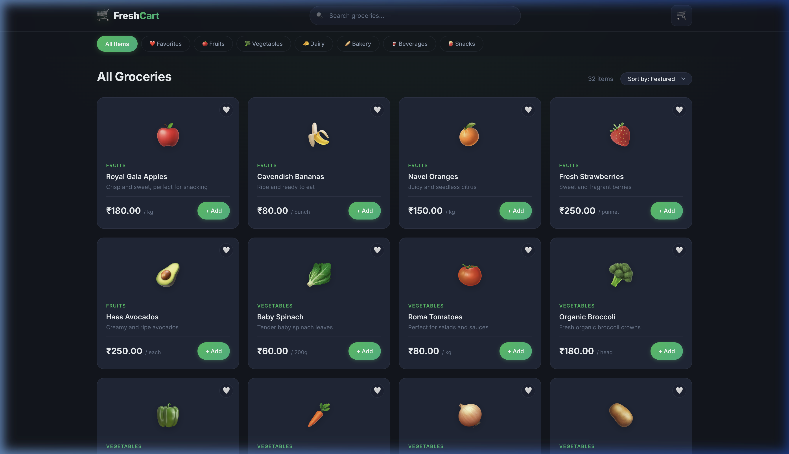
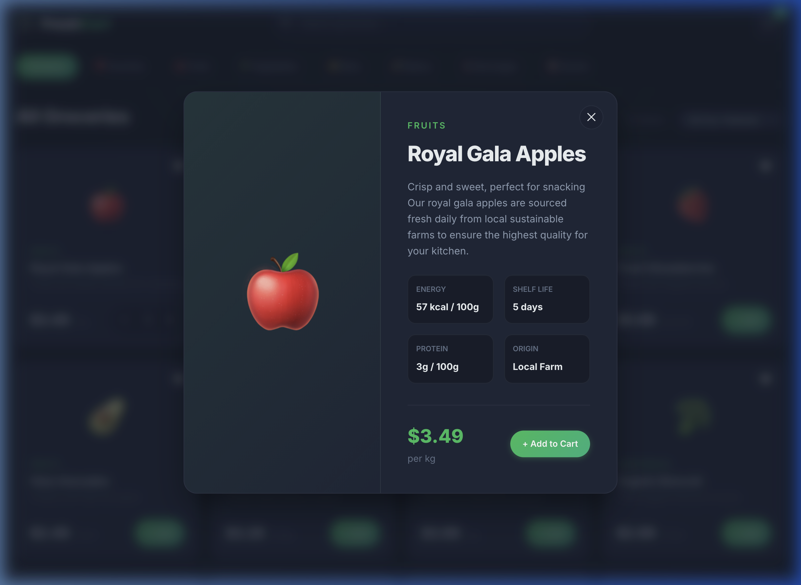

# 🛒 FreshCart — Premium Grocery Store


FreshCart is a sleek, modern, and high-performance full-stack grocery application designed for a premium shopping experience. Built with a focus on rich aesthetics, smooth interactions, and a simplified checkout flow.


## ✨ Highlights

- **💎 Modern Dark UI**: Premium glassmorphism design with smooth animations.
- **🇮🇳 Indian Market Ready**: Standard INR (₹) pricing and local product units.
- **🛍️ Easy Discovery**: Category filters, real-time search, and price sorting.
- **⚡ Fast Checkout**: Streamlined 1-click payment simulation.

## 🚀 Tech Stack

- **Frontend**: HTML5, CSS3, JavaScript (ES6+)
- **Backend**: Node.js, Express.js

## 🛠️ Quick Start

1. **Clone & Install**:
   ```bash
   git clone https://github.com/Chiraggg99/Fresh_Cart_Grocery_.git
   cd Fresh_Cart_Grocery_ && npm install
   ```

2. **Run**:
   ```bash
   npm start
   ```
   Open `http://localhost:3000`

## 📸 Showcase

<p align="center">
  
</p>
<p align="center">
  
  
</p>

## 📦 Project Structure

```text
├── public/          # Frontend assets (HTML, CSS, JS)
│   ├── css/         # Modern styling & animations
│   ├── js/          # Frontend logic (Cart, Products, API)
│   └── index.html   # Main application shell
├── server/          # Node.js/Express backend
│   ├── data/        # Product and Mock Data
│   ├── routes/      # API Endpoints
│   └── index.js     # Server entry point
├── vercel.json      # Deployment configuration
└── package.json     # Project dependencies
```

## 📄 License

Distributed under the MIT License. See `LICENSE` for more information.

## 🤝 Contributing

This is an open-source project. Contributions, issues, and feature requests are welcome!
1. Fork the Project
2. Create your Feature Branch (`git checkout -b feature/AmazingFeature`)
3. Commit your Changes (`git commit -m 'Add some AmazingFeature'`)
4. Push to the Branch (`git push origin feature/AmazingFeature`)
5. Open a Pull Request

## 🗺️ Roadmap

- [ ] **User Authentication**: Allow users to create accounts and save addresses.
- [ ] **Real Payment Integration**: Integrate Razorpay or Stripe for actual transactions.
- [ ] **Order Tracking**: Real-time status updates for active orders.
- [ ] **Reviews & Ratings**: Let customers share feedback on products.

---
Built with ❤️ by [Chirag Singh](https://github.com/Chiraggg99)
